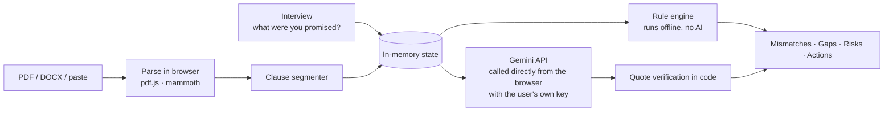

# RentReady

**Know what you're signing before you get the keys.**

RentReady helps renters in India check a rental agreement *against what they were actually promised*. You answer a few short questions about the deal you agreed to — rent, deposit, notice period, who fixes what — then upload the agreement. RentReady shows you three things:

1. **Mismatches** – where the paper says something different from what you were told.
2. **Missing protections** – what a fair agreement normally covers but yours doesn't mention at all.
3. **Risky clauses** – terms that are one-sided or unusual, with the exact clause text and page shown beside every claim.

Then it gives you something to *do*: a polite message you can send the landlord or broker asking for specific changes, a move-in inspection checklist to protect your deposit, and a set of questions for a lawyer if you need one.

> ⚖️ RentReady gives information, not legal advice. Rental law in India varies by state and changes over time. For anything serious, talk to a qualified advocate.

---

## Why this exists

Most renting problems don't start in court. They start with a verbal promise ("deposit is two months, fully refundable") that quietly becomes something else on paper ("three months, subject to deductions at the owner's discretion"), and a tenant who signs because reading eleven pages of legal English on a broker's phone isn't realistic.

Two things make that worse:
- **What's missing hurts most.** Agreements that never mention who pays for major repairs, how the deposit is returned, or how much notice the landlord must give before entering cause more disputes than the clauses people actually read.
- **Nobody knows what "normal" is.** A first-time renter has nothing to compare against.

RentReady is built around exactly those two blind spots.

## Who it's for

Renters in India signing a residential rental or leave-and-licence agreement: students, first-job employees sharing a flat, young families relocating for work, and anyone renting without a broker to argue for them.

## Why not just paste it into a chatbot?

| General AI chatbot | RentReady |
|---|---|
| You must already know what to ask | A 2-minute interview captures the deal *you* were promised, and everything is checked against that |
| Summarises what's in the document | Also reports what's **absent** — checked against a fixed list of protections a fair agreement covers |
| Answers you can't verify | Every claim shows clause number, page, and the original text, with the quote verified in code |
| Guesses when the document is silent | Says "Your agreement doesn't cover this" and turns it into a question to ask |
| Gives you a wall of text | Gives you a negotiation message, a move-in checklist, and a deposit timeline |
| Your document goes to someone's server | **Nothing leaves your device except the text you choose to analyse, sent straight from your browser to Google's Gemini API with your own key** |

## How it works (no backend at all)

RentReady is a pure static React app on Cloudflare Pages. There is no server, no database, no account.



Because there's no server to hold a secret, **you bring your own free Gemini API key** from Google AI Studio. It stays in the browser tab, is sent only to Google, and is never stored anywhere by us. There's also a **Demo mode** with a bundled sample agreement and recorded responses, so anyone can try the whole app without a key.

## Features

- **2-minute interview** – rent, deposit, duration, notice, lock-in, maintenance, repairs, entry, pets, guests.
- **Promise-gap report** – agreed vs written, with the clause that proves it.
- **Missing-protection checks** – deterministic checklist of what a fair agreement covers.
- **Risk flags with Indian rental context** – deposit size, lock-in, entry without notice, essential-services cut-off, eviction terms, registration and stamping.
- **Grounded Q&A** – verified citations or an explicit "not in your agreement".
- **Negotiation pack** – a polite WhatsApp/email message and suggested replacement wording for each change you want.
- **Move-in kit** – inspection checklist, photo evidence guide, meter readings, and a deposit-return timeline.
- **Works on a weak connection** – rule checks and the interview run fully offline; AI is an optional layer.
- **Accessible** – WCAG 2.2 AA target, keyboard-only use, screen-reader labels, light and dark themes, read-aloud, a plain-English glossary, and a reading-level setting for AI explanations.

## Tech stack

React 19 · Vite · TypeScript (strict) · Tailwind CSS · Zod · Gemini API (direct browser fetch, BYOK) · pdf.js · mammoth · vite-plugin-pwa · Vitest · React Testing Library · Playwright · axe-core · Cloudflare Pages · GitHub Actions

## Quick start

```bash
cd rentready
npm install
npm run dev          # http://localhost:5173 — starts in Demo mode, no key needed
```

Run these from the `rentready/` folder:

| Script | Purpose |
|---|---|
| `npm run lint` / `npm run typecheck` | ESLint (incl. jsx-a11y) / `tsc --noEmit` |
| `npm test` / `npm run test:coverage` | Unit + component tests |
| `npm run build && npm run test:e2e` | Playwright + axe against the production build and CSP |
| `npm run eval` | Golden-set evaluation against the real Gemini API (needs a key in `.env.local`) |
| `npm run build` | Static production build to `dist/` |

## Quality at a glance

| Measure | Result |
|---|---|
| Unit + component tests | **429** passing (Vitest + Testing Library, axe on every interview step and report state) |
| End-to-end tests | **22 journeys × 2 viewports = 44** passing (Playwright + axe, desktop and Pixel 7) |
| Coverage, `src/core` | 99.7% lines · 97.6% branches · **100%** for `verify/`, `rules/`, `interview/` (enforced in CI) |
| Initial JS | **135.8 KB gzip** (budget 200 KB); pdf.js and mammoth load only when a file is chosen |
| Offline | Interview → paste → full rule report with **zero network requests** (`e2e/report.spec.ts`) |
| AI calls per report | 1 (analysis); Ask and message polish on demand; session budget of 12 |
| Production dependencies with known vulnerabilities | 0 (`npm audit --omit=dev`) |
| Golden set, offline | 5 agreements · rule recall **100%** (23/23) · rule precision **100%** (23/23) — enforced in CI |
| Golden set, live (partial) | First run hit free-tier limits after one agreement: quote verification 13/13, latency 14.4 s. Full run: put `GEMINI_API_KEY=...` in `rentready/.env.local` (gitignored), then `npm run eval` |

## Claims you can check

| Claim | Evidence |
|---|---|
| The model reports, the code judges | Verdicts in [`src/core/interview/compare.ts`](rentready/src/core/interview/compare.ts); rules in [`src/core/rules/rental.ts`](rentready/src/core/rules/rental.ts) read the agreement via [`extract.ts`](rentready/src/core/rules/extract.ts) |
| Every quote is verified | [`src/core/verify/verifyQuote.ts`](rentready/src/core/verify/verifyQuote.ts); unverified evidence → "Couldn't confirm", uncited "covered" → unclear ([`analysis.ts`](rentready/src/core/analysis.ts)) |
| Demo is as honest as live | [`src/sample/sampleData.test.ts`](rentready/src/sample/sampleData.test.ts) fails if any recorded quote stops verifying |
| Prompt injection changes nothing | [`src/core/injection.test.ts`](rentready/src/core/injection.test.ts) |
| The key never leaks | [`e2e/key.spec.ts`](rentready/e2e/key.spec.ts): not in page text, URL, storage or downloads; sent only as `x-goog-api-key` |
| Exactly one external origin | CSP `connect-src 'self' https://generativelanguage.googleapis.com`; E2E runs under the production headers ([`vite.config.ts`](rentready/vite.config.ts), [`e2e/shell.spec.ts`](rentready/e2e/shell.spec.ts)) |
| Hostile files are refused | Magic bytes must match the extension; size/page/char caps ([`src/core/parsing/intake.ts`](rentready/src/core/parsing/intake.ts), `e2e/upload.spec.ts`) |

## Judging criteria map

| Criterion | Where to look |
|---|---|
| Problem statement alignment | This README, [`docs/PRD.md`](rentready/docs/PRD.md), [`docs/INTERVIEW_SPEC.md`](rentready/docs/INTERVIEW_SPEC.md); the interview → report → message flow |
| Code quality | Strict TS (`noUncheckedIndexedAccess`, `exactOptionalPropertyTypes`), pure `src/core` domain layer (no React, runs in Node for the eval script) |
| Security | [`docs/SECURITY.md`](rentready/docs/SECURITY.md), the "Claims you can check" table above |
| Efficiency | Offline rules, one AI call per report, lazy parsers, 135.8 KB initial JS |
| Testing | [`docs/TESTING.md`](rentready/docs/TESTING.md), `npm run test:coverage`, `npm run test:e2e` |
| Accessibility | [`docs/ACCESSIBILITY.md`](rentready/docs/ACCESSIBILITY.md); axe in component and E2E tests; keyboard-only interview journey |

## Known limitations

- English only for now: the Hindi dictionary is incomplete, so the language switch is hidden.
- Demo-mode AI responses are hand-authored against the sample agreement (and verification-tested), not recorded from Gemini.

## Documentation

[`PRD`](rentready/docs/PRD.md) · [`INTERVIEW_SPEC`](rentready/docs/INTERVIEW_SPEC.md) · [`ARCHITECTURE`](rentready/docs/ARCHITECTURE.md) · [`AI_PIPELINE`](rentready/docs/AI_PIPELINE.md) · [`LEGAL_RULES`](rentready/docs/LEGAL_RULES.md) · [`UX_FLOW`](rentready/docs/UX_FLOW.md) · [`SECURITY`](rentready/docs/SECURITY.md) · [`TESTING`](rentready/docs/TESTING.md) · [`ACCESSIBILITY`](rentready/docs/ACCESSIBILITY.md) · [`DEPLOYMENT`](rentready/docs/DEPLOYMENT.md)

## Disclaimer

RentReady is an educational tool. It does not create a lawyer–client relationship, may be incomplete or wrong, and does not know your state's rent control or tenancy rules in detail. Always confirm important points with a qualified advocate before signing.
