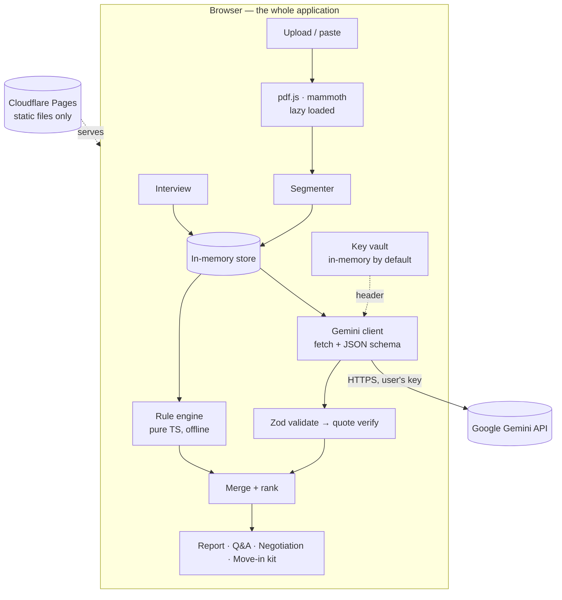

# RentReady – Architecture

## 1. Constraint and consequence
**Constraint:** static hosting on Cloudflare Pages, React only, no backend of any kind.
**Consequence:** there is no place to hide a secret, so the app never holds one. The user supplies their own Gemini API key (BYOK), which lives in the browser tab and is sent only to Google. Everything else — parsing, segmentation, rules, comparison, verification, exports — is pure client-side TypeScript.

This turns a limitation into two product properties worth defending in the pitch:
- **No document ever reaches a third-party server we control.** There is no server.
- **The app keeps working without AI.** The interview, rule engine, protection checklist, move-in kit and exports are deterministic and run offline.



## 2. Repository layout
```
rentready/
├─ src/
│  ├─ core/                      # pure domain logic, no React, no DOM
│  │  ├─ types.ts                # Clause, InterviewAnswers, MatchRow, GapRow, RuleHit…
│  │  ├─ schemas.ts              # Zod: AI responses + app state
│  │  ├─ limits.ts               # size/page/char caps, request budget
│  │  ├─ interview/              # questions.ts, normalise.ts, compare.ts
│  │  ├─ parsing/                # pdfParser.ts, docxParser.ts, segmenter.ts
│  │  ├─ verify/                 # normalize.ts, verifyQuote.ts
│  │  ├─ rules/                  # rental.ts (rule library), protections.ts (checklist), index.ts
│  │  ├─ gemini/                 # client.ts, prompts.ts, responseSchemas.ts, demo/ (fixtures)
│  │  ├─ negotiation/            # builder.ts (message + suggested wording)
│  │  └─ movein/                 # checklist.ts, timeline.ts
│  ├─ features/                  # React feature folders
│  │  ├─ interview/  upload/  report/  ask/  negotiate/  movein/  key/  a11y/
│  ├─ components/                # Button, Tabs, Badge, Dialog, Progress, Skeleton, Mark
│  ├─ state/                     # AppProvider: context + useReducer
│  ├─ i18n/                      # en.ts, hi.ts, t()
│  ├─ sample/                    # sample agreement text + recorded AI responses (demo mode)
│  └─ styles/
├─ tests/                        # unit + component tests, fixtures/
├─ e2e/                          # Playwright specs
├─ scripts/eval.ts               # golden-set eval via tsx (Node, uses src/core)
├─ public/_headers               # CSP and security headers (static)
├─ public/manifest.webmanifest   # PWA
├─ .github/workflows/ci.yml
├─ CLAUDE.md · docs/          # README.md lives at the repository root
└─ vite.config.ts · tsconfig.json · eslint.config.js
```
`src/core` must never import React or browser-only globals beyond `fetch`, `TextEncoder` and `crypto`, so it can run in Node for `scripts/eval.ts` and in tests.

## 3. Core types
```ts
export type ProtectionId =
  | 'DEPOSIT_AMOUNT' | 'DEPOSIT_REFUND_TIMELINE' | 'DEPOSIT_DEDUCTION_BASIS'
  | 'RENT_AMOUNT' | 'RENT_DUE_DATE' | 'RENT_INCREASE' | 'MAINTENANCE_CHARGES'
  | 'REPAIRS_MAJOR' | 'REPAIRS_MINOR' | 'NOTICE_TENANT' | 'NOTICE_LANDLORD'
  | 'LOCK_IN' | 'ENTRY_NOTICE' | 'ESSENTIAL_SERVICES' | 'SUBLET_GUESTS'
  | 'RENEWAL' | 'SALE_OF_PROPERTY' | 'REGISTRATION_STAMPING' | 'INVENTORY_HANDOVER'
  | 'DISPUTE_RESOLUTION';

export interface Clause { id: string; label: string|null; heading: string|null; text: string; page: number|null; pageEnd: number|null; order: number; }

export interface VerifiedQuote { clauseId: string; quote: string; status: 'verified'|'fuzzy'|'unverified'; start?: number; end?: number; }

export interface MatchRow {
  key: keyof InterviewAnswers;
  agreed: string;              // what the user said, as displayed
  written: string | null;      // what the agreement says, as displayed
  verdict: 'matches'|'differs'|'not_covered'|'unclear';
  severity: 'HIGH'|'MEDIUM'|'INFO';
  evidence: VerifiedQuote | null;
  note: string;                // plain-language explanation
  suggestedQuestion: string | null;
}

export interface GapRow { id: ProtectionId; title: string; state: 'present'|'absent'|'unclear'; evidence: VerifiedQuote|null; whyItMatters: string; requestWording: string|null; }

export interface RuleHit { ruleId: string; clauseId: string|null; severity: 'HIGH'|'MEDIUM'|'INFO'; title: string; message: string; basis: string; questions: string[]; lastReviewed: string; }

export interface AskResult { status: 'answered'|'not_in_document'|'needs_professional'; answer: string; citations: VerifiedQuote[]; missingInfo: string[]; suggestedQuestions: string[]; }
```

## 4. Pipeline
```
Interview answers ─┐
                   ├─► buildAnalysisPrompt() ─► Gemini (one call, structured JSON)
Clauses ───────────┘                                   │
                                                       ▼
                                Zod parse → drop unknown clauseIds → verifyQuote()
                                                       │
Rule engine (offline) ─────────────────────────────────┼──► merge & rank ──► Report
Protection checklist (offline skeleton) ───────────────┘
```
**One AI call** produces: `matchFindings[]` (what the agreement says for each answered interview key), `protectionFindings[]` (presence/absence per checklist id), and a short `overview`. Verdicts, severities and comparisons are computed in `src/core/interview/compare.ts` — never by the model. For agreements over ~120 clauses, split into two calls and merge.

Q&A and negotiation wording are separate, smaller calls made on demand.

### Request budget
A session counter caps AI calls (default 12) and shows remaining calls, protecting the user's free-tier quota. Configurable in settings; resets on reload.

## 5. Parsing and segmentation
- **PDF:** `pdfjs-dist` via dynamic `import()` after a file is chosen; worker imported with `?url`. Lines rebuilt from `textContent.items` using `hasEOL` and y-gaps; page recorded per line. If extracted characters per page < 100 → scanned document: explain and offer the paste-text path (F17 stretch: consented Gemini OCR).
- **DOCX:** `mammoth.extractRawText`, dynamic import; `page: null`, display "Paragraph N".
- **Segmenter:** starts a clause on `^\s*\d+(\.\d+){0,3}[.)]?\s+\S`, `^(Clause|Article|Section)\s+\d+`, `^\(?[a-z]\)\s`, `^\(?[ivx]{1,4}\)\s`, or an ALL-CAPS heading ≤ 8 words; otherwise paragraph fallback merged to ≥ 200 chars and split above 2,000 chars at sentence boundaries. IDs `c001…`; schedules/annexures tagged so deposit and inventory details inside them are still found.

## 6. Verification
```
normalize: NFKC → lowercase → curly quotes/dashes → ASCII → collapse whitespace → strip zero-width & soft hyphens
verifyQuote(clauseText, quote):
  quote.length < 12                      → 'unverified'
  normalized clause contains quote       → 'verified' (+ offsets mapped back for <mark>)
  sliding-window token similarity ≥ 0.9  → 'fuzzy'
  otherwise                              → 'unverified'
```
Pages come from our `Clause` records. The model only ever returns `clauseId` + `quote`. A `MatchRow` whose evidence is `unverified` becomes `unclear`, never `differs`.

## 7. Key handling (see SECURITY.md)
`src/core/gemini/client.ts` takes the key as an argument; it is held in a React context (`KeyProvider`) in memory. Optional "remember for this tab" uses `sessionStorage` behind an explicit checkbox with a plain warning. The key is never logged, never included in exports, never placed in URLs, and is redacted from any error message. `Forget key` clears context and storage.

Demo mode (`?demo=1` or the Demo button) uses `src/sample/*` recorded responses through the same pipeline, including verification, so judges see real behaviour without a key.

## 8. State
Context + `useReducer`. Slices: `interview`, `document` (file meta + clauses), `analysis` (match/gap/rule rows), `qa[]`, `negotiation`, `movein`, `prefs`, `key`, `budget`. Nothing persisted except `prefs` and the optional key choice. A single `RESET_ALL` action powers "Clear everything".

## 9. Errors
Typed `AppError { code, message, retryable }` with codes `INVALID_FILE`, `TOO_LARGE`, `SCANNED_PDF`, `NO_KEY`, `KEY_REJECTED`, `RATE_LIMITED`, `QUOTA`, `MODEL_BLOCKED`, `MODEL_INVALID_OUTPUT`, `NETWORK`, `BUDGET_EXHAUSTED`. Each maps to an i18n message with a next step ("Your key was rejected. Check it in Google AI Studio, or continue in Demo mode."). Gemini client: 25 s `AbortController` timeout, one retry on 429/5xx with jittered backoff, one JSON-repair retry, then fail cleanly.

## 10. Performance budgets
| Budget | Target |
|---|---|
| Initial JS (gzip) | < 200 KB — parsers, export and PWA chunks lazy-loaded |
| First analysis (10-page agreement) | < 20 s p50 |
| Offline path (interview + rules + kit) | 0 network requests |
| AI calls per full report | 1 |
| Memory | agreement text held once; no duplicate copies per feature |

Efficiency levers: single batched analysis call; `temperature: 0.2`; bounded `maxOutputTokens`; rules and checklist computed locally instead of asked of the model; results memoised so tab switches never re-call; request budget counter.

## 11. Build and hosting
Vite static build → `dist/` → Cloudflare Pages (no Functions, no bindings). `public/_headers` supplies CSP and security headers. `vite-plugin-pwa` in `generateSW` mode precaches the app shell; AI calls are network-only and fail gracefully offline.
